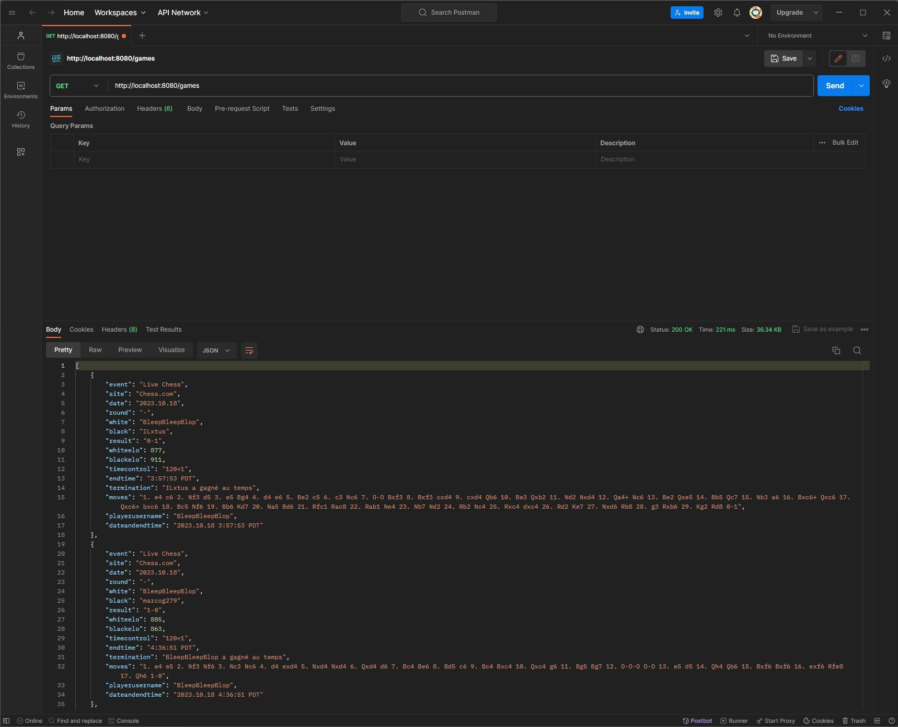

# ChessResultAnalyzerJava

## The project

The purpose of this project is to visualize your chess game stats, 

ChessResultAnalyzerJava is a Java copy of LinqProject-API (which was created with C#) https://github.com/jorisreynes/LinqProject-API

The application is built with Java and Maven, and you can download the Angular interface from the LinqProject-Angular repository : https://github.com/jorisreynes/LinqProject-Angular

## How it works

You need to download the .pgn file from Chess.com, you can upload it with the Angular front (or with Postman if you prefer)

Once the file is sent on the backend, you can see your winrate and you can filter the games with the Opening, the color, and the End of game

For example you can see your winrate with the Scotch opening, or compare your winrate with white or black, or see your winrate because of checkmate or time (interesting if you play blitz)

## Other

I created the same project with the MERN stack to compare, you can find the repo here : https://github.com/jorisreynes/mern

This project is not finished because finally there is a Chess.com API with more data than what we have in the .pgn file, so the backend is not needed anymore, 

There is a new version, frontend only, of this project here : https://github.com/jorisreynes/ChessGameStats

## How to install it :

````
git clone https://github.com/jorisreynes/ChessResultAnalyzerJava.git
````

````
cd ChessResultAnalyzerJava
````

- Open the folder with your IDE

- Launch the project

You can make API calls on http://localhost:8080/games

(the database is a MongoDB Atlas cluster and can be paused due to inactivity)


